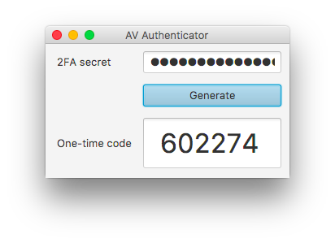

# Authenticator-Desktop

## General
Authenticator-Desktop is a simple user interface for generating one-time passwords (TOTP) on the desktop (instead of Authy, Duo Mobile, Google Authenticator on the phone).

Authenticator-Desktop should only be used in certain circumstances and only by people that know their threat model.

## Security
Preferably Authenticator-Desktop should be run on a separate virtual machine or physical host that is not connected to any network including the Internet (to get the second factor vibe).
The 2FA secret should be stored securely (e.g. in an offline password manager).

## Requirements
Java 8: Oracle JDK or OpenJDK with Java FX (openjfx)

## Build
Build a fat jar:

	./gradlew clean shadowJar
	
The built jar can be found in the build/libs folder.
	
## Run

	java -jar Authenticator-Desktop-all.jar

## Technology
Authenticator-Desktop makes use of JavaFX and uses JBoss [aerogear-otp-java](https://github.com/aerogear/aerogear-otp-java) to generate one-time passwords. The aerogear-otp-java dependency is verified with the [gradle-witness](https://github.com/WhisperSystems/gradle-witness) plugin.